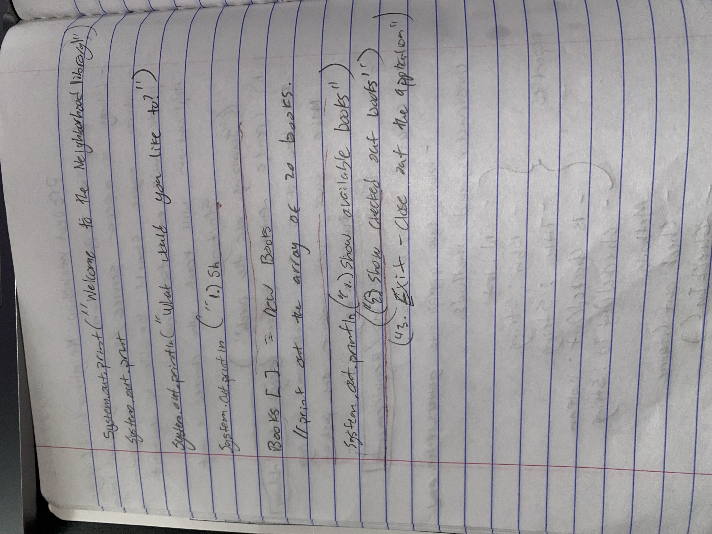
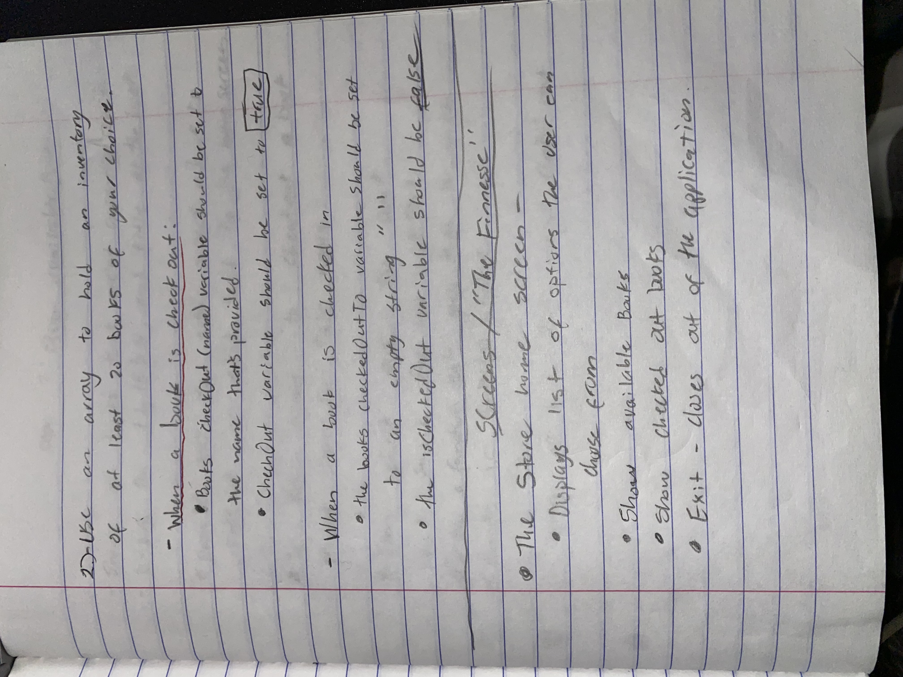
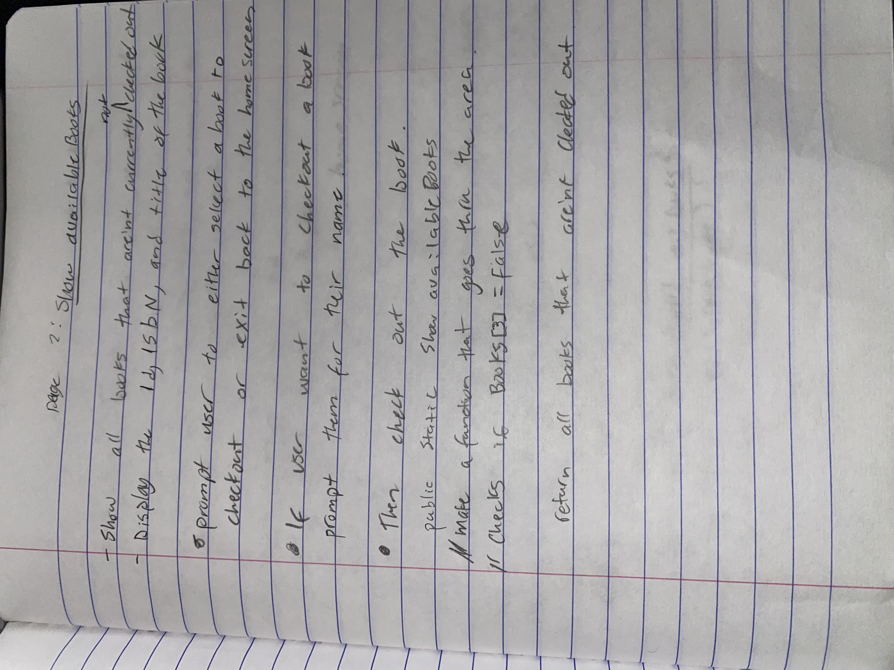
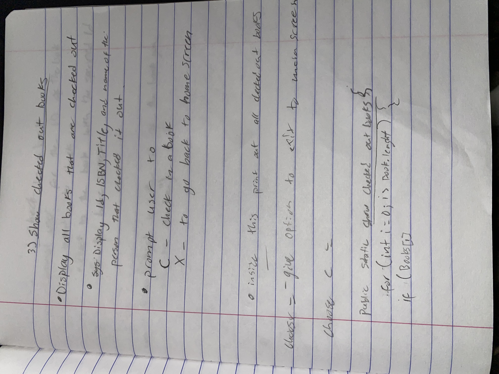
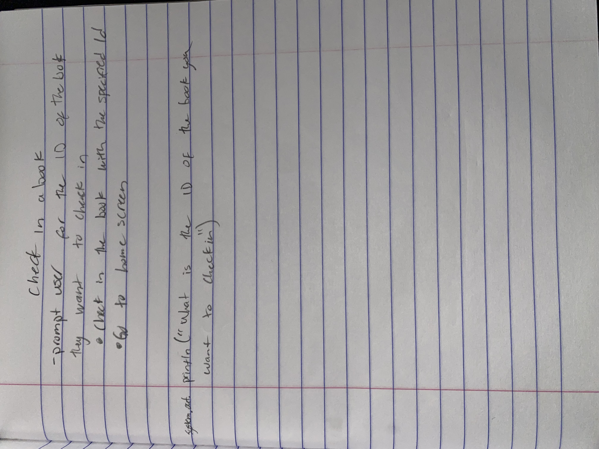

# Welcome to the Neighborhood Library!

This the first workshop of this class and I was excited to do it even though it was a bit challenging.  
I started planning everything out in my notebook.

## First part of planning on paper

- Here I was planning how I would print the introductions to the library.

- I was able to think out what choices the user 

- Here I thoughout how I would do show all available books to the user.

- This is where I tried to plan how I would show checked out books to the user.

- Finally I planned out how to get the user to check in a book.  

# Below is my all the code I put together for our library!
package com.pluralsight;

import java.util.Scanner;

public class Main {

    static final Scanner userInput =  new Scanner(System.in);

    public static void main (String [] args){

// create the array
        Books[]  book =  {
        new Books(1, "1242144244323", "The Great Gatsby", false, ""), 
        new Books(2, "9780061120084", "To Kill a Mockingbird", false, ""), 
        new Books(3, "9780451524935", "1984", false, ""), 
        new Books(4, "9780316769488", "The Catcher in the Rye", false, "Jane Smith"), 
        new Books(5, "9780547928227", "The Hobbit", false, ""), 
        new Books(6, "9780451526342", "Animal Farm", false, ""), 
        new Books(7, "9780399501487", "Lord of the Flies", false, ""), 
        new Books(8, "9780060850524", "Brave New World", false, ""), 
        new Books(9, "9781451673319", "Fahrenheit 451", false, ""), 
        new Books(10, "9780143039433", "The Grapes of Wrath", true, "Michael Wilson"), 
        new Books(11, "9780140177398", "Of Mice and Men", false, ""), 
        new Books(12, "9780141439518", "Pride and Prejudice", true, "Sophia Lee"), 
        new Books(13, "9780553213119", "Moby-Dick", false, ""), 
        new Books(14, "9780544003415", "The Lord of the Rings", true, "Alex Martinez"), 
        new Books(15, "9780316769488", "The Catcher in the Rye", false, ""), 
        new Books(16, "9780061120084", "To Kill a Mockingbird", true, "Jessica Brown"), 
        new Books(17, "9780743273565", "The Great Gatsby", false, ""), 
        new Books(18, "9780451524935", "Nineteen Eighty-Four", true, "Daniel Johnson"), 
        new Books(19, "9780547928227", "The Hobbit", false, ""), 
        new Books(20, "9780451526342", "Animal Farm", true, "Sophie Taylor"), 
        };

        int choice = 0;
        while (choice != 4) {
            System.out.println();
            System.out.println("Hello welcome to our neighborhood library!");
            System.out.println("We're excited to have you here");
            System.out.println("What would you like to do?");

            //System.out.println("What do you want to do?");
            System.out.println();
            System.out.println("1 - Show available books");
            System.out.println("2 - Show checked out books");
            System.out.println("3 - Check in a book");
            System.out.println("4 - Go back to home screen");
            choice = Integer.parseInt(userInput.nextLine());

            //System.out.println("5 - Add a vehicle");
        switch (choice){
            case 1:
                // Show available books call below
                listAvailableBooks(book);

                break;

            case 2:
                // show checked out books here call below
                listCheckedOutBooks(book);

                break;

            case 3:
                // check in  a book call this below
                // checkInBooks

                break;

            case 4:
                System.out.println();
                System.out.println("Goodbye!");
                break;

            default:
                System.out.println();
                System.out.println("Invalid selection");
                break;
        }

        }

    }

    // This function helps with showing the user all available books in the library
    public static void listAvailableBooks(Books[] book){
        System.out.println("Here are all the available books");
        for (int i = 0; i < book.length; i++){
            if (!book[i].getCheckOut()){
                System.out.println();
                System.out.printf("%d,%s,%s,%b,%s\n", book[i].getBookId(), book[i].getBookIsbn(), book[i].getTitle(), book[i].getCheckOut(), book[i].getCheckOutTo());
            }
        }
        // Helps with checking out a book
        System.out.println();
        System.out.println("Would you like to check in a book1?");
        System.out.println("1 - Yes I would like to check out a book");
        System.out.println("2 - Go back to home screen");
        int choice = Integer.parseInt(userInput.nextLine());
        if (choice == 1) {
            System.out.println("What's the book ID number?");
            int bookID = Integer.parseInt(userInput.nextLine());
            System.out.println("What's your name");
            String name = userInput.nextLine();
            // for loop through all books
            for (int i = 0; i < book.length; i++) {
                if (book[i].getBookId() == bookID) {
                    book[i].checkOut(name);
                } else {
                    System.out.print("Sorry that book is checked out by someone else.");
                    break;
                }
            }
        }
    }
    // This function helps with showing user books that are checkout
    public static void listCheckedOutBooks(Books[] book){
        System.out.println("Here are all of the books that are checked out currently");
        for (int i = 0; i < book.length; i++){
            if (book[i].getCheckOut()){
                System.out.printf("%d,%s,%s,%b,%s\n", book[i].getBookId(), book[i].getBookIsbn(), book[i].getTitle(), book[i].getCheckOut(), book[i].getCheckOutTo());
            }
        }
        // Helps us with the process of checking in a book
        System.out.println();
        System.out.println("Would you like to check in a book?");
        System.out.println("1 - Yes I would like to check in a book");
        System.out.println("2 - Go back to the home screen");
        int choice = Integer.parseInt(userInput.nextLine());
        if (choice == 1){
            System.out.println("What's the book ID number?");
            int bookID = Integer.parseInt(userInput.nextLine());
            // for loop through all books
            for (int i = 0; i < book.length; i++ ){
                if (!book[i].getCheckOut()){
                    book[i].checkIn();
                    break;
                }
            }
        }
    }
}
